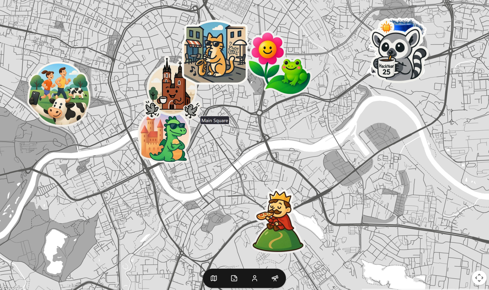

# Just Stick Around

## #HackYear25

This project is a part of the [HackYear25](https://hackyeah.pl) challenge. "Travel" category

## [Demo](https://just-stick-around.justadomainname.dev/)

Just `email` and `password` -> click on fourth icon -> and try to make a photo with hack year to open your firs sticker.


---

## Develop

### Installation

First, create a PostgreSQL Database then configure your environment variables.

You can generate a `BETTER_AUTH_SECRET` [here](https://www.better-auth.com/docs/installation#set-environment-variables).

```bash
BETTER_AUTH_SECRET=""
DATABASE_URL=""
```

Then generate your schema and perform migrations with drizzle-kit.

```bash
npx @better-auth/cli generate
npx drizzle-kit generate
npx drizzle-kit migrate
```

### Next.js

This is a [Next.js](https://nextjs.org) project bootstrapped with [
`create-next-app`](https://nextjs.org/docs/app/api-reference/cli/create-next-app).

### Getting Started

First, run the development server:

```bash
npm run dev
# or
yarn dev
# or
pnpm dev
# or
bun dev
```

Open [http://localhost:3000](http://localhost:3000) with your browser to see the result.

You can start editing the page by modifying `app/page.tsx`. The page auto-updates as you edit the file.
