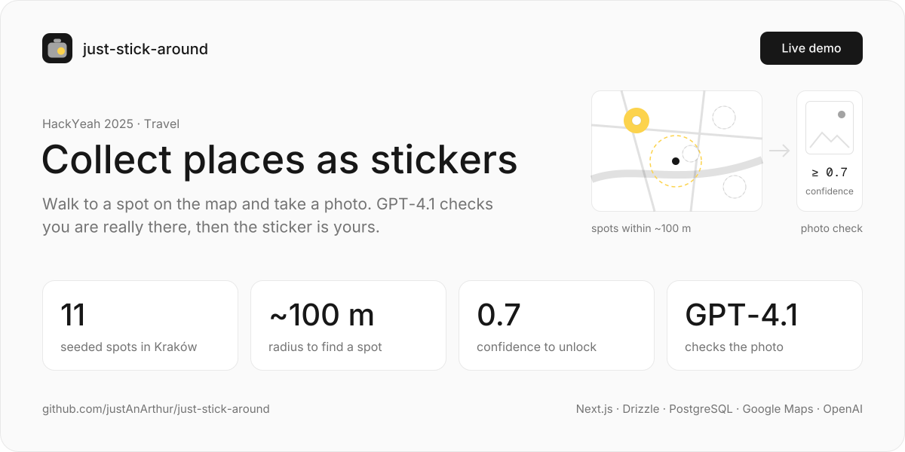
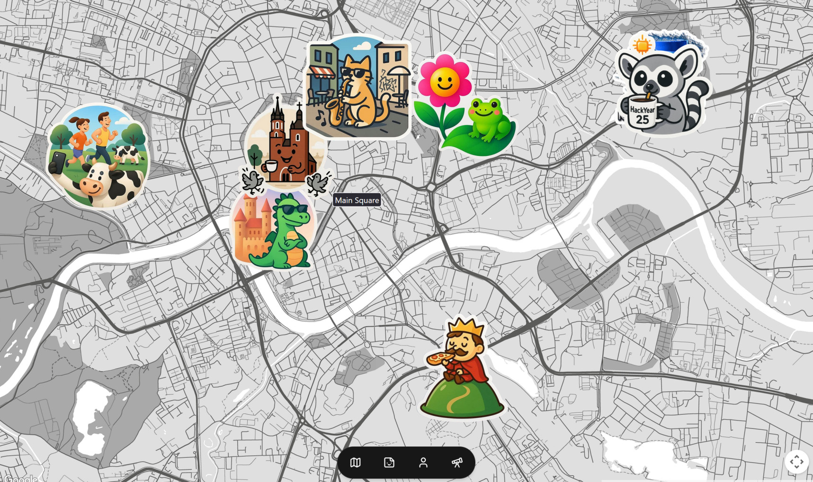
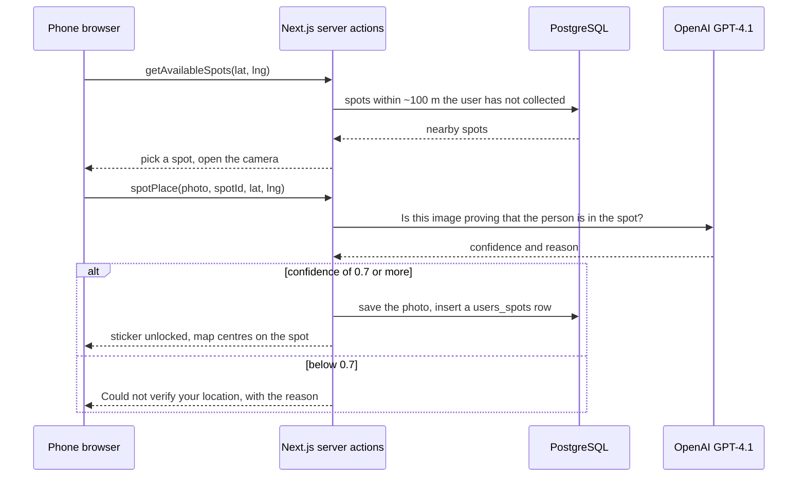

<a href="https://just-stick-around.justadomainname.dev/"></a>

# Just Stick Around

A cross-platform web app to discover and explore new places and stick them into your profile, like stickers on luggage.
Built at [HackYeah 2025](https://hackyeah.pl) in the "Travel" category.

> Finished and archived.

**[Live demo →](https://just-stick-around.justadomainname.dev/)** Sign up with just an email and password, tap the
fourth icon (the telescope) and try to take a photo with HackYear to open your first sticker.



## What it does

- Shows spots on a Google Map, centred on Kraków. Spots you have collected show their sticker; the rest show a
  placeholder, with a separate one for spots added by users
- Explore (telescope tab) finds spots within roughly 100 m of your GPS position that you have not collected yet and
  opens the camera
- Sends the photo and the spot name to GPT-4.1, which answers with a confidence and a reason; the sticker unlocks at
  0.7 or more
- A spot can depend on another one and stays hidden until you have collected that one first
- Any signed-in user can add a spot: name, description, a point picked on the map, a sticker image and photos
- The sticker tab lists what you have collected and when; each spot shows the latest 100 explorations by other users

## How it works


```mermaid
sequenceDiagram
  participant P as Phone browser
  participant S as Next.js server actions
  participant DB as PostgreSQL
  participant AI as OpenAI GPT-4.1
  P->>S: getAvailableSpots(lat, lng)
  S->>DB: spots within ~100 m the user has not collected
  DB-->>S: nearby spots
  S-->>P: pick a spot, open the camera
  P->>S: spotPlace(photo, spotId, lat, lng)
  S->>AI: Is this image proving that the person is in the spot?
  AI-->>S: confidence and reason
  alt confidence of 0.7 or more
    S->>DB: save the photo, insert a users_spots row
    S-->>P: sticker unlocked, map centres on the spot
  else below 0.7
    S-->>P: Could not verify your location, with the reason
  end
```

The distance filter is a great-circle formula in SQL. Photos and stickers are written to `public/` and their paths
are stored in the `files` table.

## Run

First, create a PostgreSQL database, then configure your environment variables. You can generate a
`BETTER_AUTH_SECRET` [here](https://www.better-auth.com/docs/installation#set-environment-variables).

```bash
cp .env.example .env    # BETTER_AUTH_SECRET, DATABASE_URL, NEXT_PUBLIC_GOOGLE_MAPS_API_KEY, OPENAI_API_KEY, NEXT_PUBLIC_TRUSTED_ORIGINS
pnpm install
```

Then generate your schema and run the migrations with drizzle-kit:

```bash
npx @better-auth/cli generate
npx drizzle-kit generate
npx drizzle-kit migrate
pnpm seed               # 11 spots around Kraków; reads .env and .env.local
pnpm dev                # http://localhost:3000
```

## Stack

Next.js 15 (App Router), React 19, TypeScript, Better Auth (email and password) with better-auth-ui, Drizzle ORM on
PostgreSQL, Google Maps through `@react-google-maps/api`, the OpenAI API (GPT-4.1), Tailwind CSS 4, Radix UI and Biome.
Started from the [better-auth-nextjs-starter](https://github.com/daveyplate/better-auth-nextjs-starter) template.

## License

[CC BY-NC-ND 4.0](LICENSE): share it with credit, but no changes and no commercial use. Don't hand it in as your own
hackathon project.
